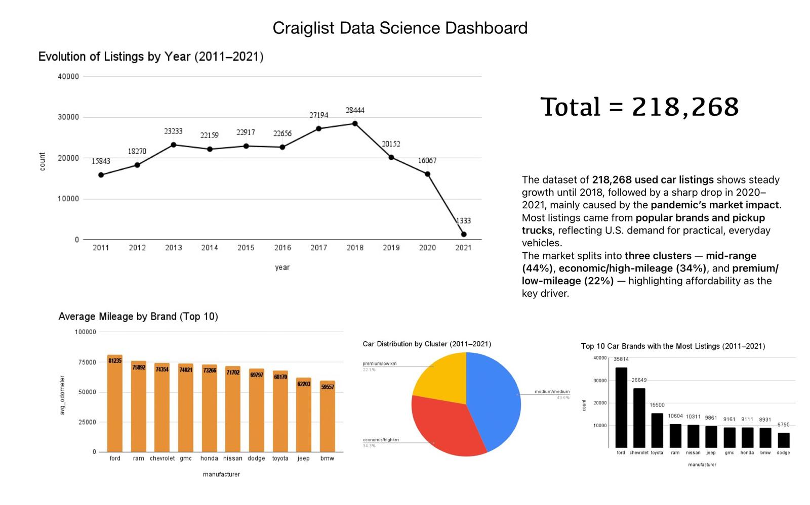

# 🚗 Craigslist Data Science Project (2011–2021)

This project analyzes over **218,000 used car listings** collected between 2011 and 2021.  
The goal was to explore long-term trends in the used car market — identifying brand dominance, mileage patterns, and market segmentation.

---

## 📊 Project Overview

The dataset covers vehicle listings with details like **year, brand, mileage, and price**.  
After cleaning and analyzing the data using Python, visualizations were combined into a final dashboard showing the main insights.

### 🔍 Key Insights

1. **Evolution of Listings by Year (2011–2021)**  
   Listings grew steadily until 2018 (28,444 listings). A sharp decline followed in 2020–2021, likely due to the pandemic’s market impact.

2. **Top 10 Car Brands with the Most Listings**  
   Ford leads with 35k+ listings, followed by Chevrolet and Toyota.  
   These three represent nearly half of the used car market.

3. **Car Distribution by Cluster (2011–2021)**  
   - Mid-range: **44%**  
   - Economic / High-mileage: **34%**  
   - Premium / Low-mileage: **22%**  
   → Affordable vehicles dominate the market.

4. **Average Mileage by Brand (Top 10)**  
   Ford and Ram show the highest mileage averages (75,000–80,000 km).  
   BMW and Toyota have the lowest, indicating lighter use.

---

## 🧠 Tools Used

- **Python:** pandas, numpy, scikit-learn, matplotlib, seaborn  
- **Jupyter Notebook** for data cleaning and exploration  
- **Google Sheets** for dashboard design and final visualization  

---

## 🧾 Results

Below is the final dashboard summarizing all visual findings:

---

